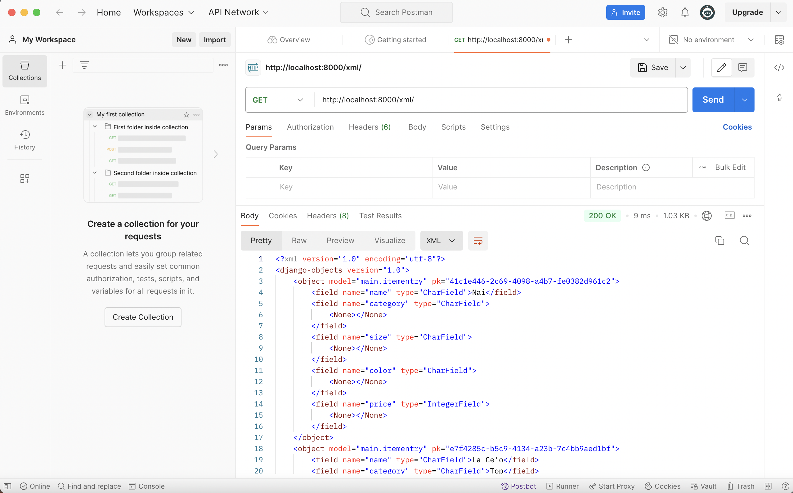

# Tugas 2: Implementasi Model-View-Template (MVT) pada Django
# PBP B

## SyreAttire
### Nama : Naila Syarifa Yosarvi
### NPM  : 2306245882
### Link : 

## 1. Jelaskan bagaimana cara kamu mengimplementasikan checklist di atas secara step-by-step (bukan hanya sekadar mengikuti tutorial).
- melakukan instalasi django dan setup github
- membuat virtual enviroment baru agar dependencies tidak akan bertabrakan dengan versi lain 
- menambahkan beberapa dependencis dan menginstallnya
- selanjutnya, membuat proyek django dengan nama SyreAttire
- selanjutkan melakukan perizinan terhadap akses semua host 
- menginisiasi direktori SyreAttire sebagai repo pada github
- kemudian menambahkan gitignore
- melakukan beberapa langkah membersihkan file sebelum di push ke github 
- membuat aplikasi bernama 'main' dan menambahkannya pada INSTALLED APPS
- membuat direktori baru bernama templates dan membuat file html
- melakukan routing agar dapat menjalankan aplikasi main tersebut 
- membuat model pada aplikasi dengan nama item serta atribute 
- kemudian membuat migrasi model dan menerapkan model tersebut ke basis data
- melakukan deployment ke Adaptable terhadap aplikasi yang sudah dibuat 

## 2. * Buatlah bagan yang berisi request client ke web aplikasi berbasis Django beserta responnya dan jelaskan pada bagan tersebut kaitan antara urls.py, views.py, models.py, dan berkas html.

- user akan menuliskan sesuatu di browser.
- klien(browser) mengirim permintaan HTTP ke Django.
- Django menerima permintaan dan menyampaikannya ke `urls.py`.
- `urls.py` akan mengarahkan request ke View sesuai url yang diterima.
- view dapat berinteraksi dengan model yang merupakan komponen yang bertanggung jawab terhadap database.
- setelah mendapatkan data dari model, maka View akan merender Template HTML dan diisi dengan data yang sesuai.
- view akan menghasilkan respons HTTP dan dikirimkan kembali ke klien.
- klien menerima respon dan menampilkan halaman web atau data yang diberikan.
- klien (browser) menampilkan halaman atau data kepada pengguna.

## 3. Jelaskan fungsi git dalam pengembangan perangkat lunak!
Dengan git user dapat mengetahui riwayat perubahan kode yang telah dilakukan, git juga bisa dilakukan kolaborator bagi para programmer dalam hal lain ini memudahkan para programmer dalam pengembangan perangkat lunak yang sedang dilakukan.

## 4. Menurut Anda, dari semua framework yang ada, mengapa framework Django dijadikan permulaan pembelajaran pengembangan perangkat lunak?
Django menyediakan fitur yang cukup cocok untuk pemula, dengan fitur dokumentasi yang lengkap, membantu user dalam mengatasi permasalahan dengan mudah. 

## 5. Mengapa model pada Django disebut sebagai ORM?
ORM merupakan teknik pemrograman yang memungkinkan user untuk berinteraksi dengan basis data relasional dalam bahasa pemrograman berorientasi objek,python. ORM sebagai perantara antara model objek dan tabel basis data, sehingga tidak perlu menuris query SQL untuk operasi basis data. 

# Tugas 3: I Implementasi Form dan Data Delivery pada Django
# PBP B

## 1. Jelaskan mengapa kita memerlukan data delivery dalam pengimplementasian sebuah platform?
Data delivery merupakan komponen penting dalam implementasi platform karena memastikan bahwa data dapat ditransfer, diproses, dan digunakan secara efektif antara berbagai komponen sistem dan antara sistem dengan user. Ini mendukung pertukaran informasi yang efisien, interaksi user yang responsif, dan keamanan data. Data delivery membuat platform memberikan fungsionalitas dan pengalaman pengguna yang kaya dan dinamis.

## 2. Menurutmu, mana yang lebih baik antara XML dan JSON? Mengapa JSON lebih populer dibandingkan XML?
Karena lebih sederhana, JSON lebih baik dibandingkan XML. JSON menggunakan format key-value yang lebih efisien dan memiliki ukuran data yang lebih kecil, sehingga mempercepat transfer data. Selain itu, JSON didukung secara bawaan oleh banyak bahasa pemrograman, terutama JavaScript, sehingga lebih mudah diintegrasikan dalam pengembangan web dan aplikasi modern.Sementara XML lebih kompleks dan mendukung validasi data yang ketat, JSON lebih populer karena kemudahan dan efisiensinya, terutama dalam aplikasi yang memerlukan pertukaran data cepat seperti API dan layanan web.

## 3. Jelaskan fungsi dari method is_valid() pada form Django dan mengapa kita membutuhkan method tersebut?
Method is_valid() akan memeriksa data yang dikirimkan ke form dan memastikan bahwa data tersebut memenuhi semua aturan validasi yang telah didefinisikan dalam form. Ini memastikan keamanan, integritas data, dan memberikan pengalaman pengguna yang lebih baik dengan menangkap dan menangani kesalahan input.

## 4. Mengapa kita membutuhkan csrf_token saat membuat form di Django? Apa yang dapat terjadi jika kita tidak menambahkan csrf_token pada form Django? Bagaimana hal tersebut dapat dimanfaatkan oleh penyerang?
csrf_token adalah komponen penting dalam keamanan aplikasi web Django. Ini untuk melindungi aplikasi dari serangan CSRF (Cross-Site Request Forgery), sebuah jenis serangan di mana penyerang mencoba mengeksploitasi kepercayaan yang dimiliki oleh situs web pada browser user. Jika tidak menambahkan csrf_token pada form Django, aplikasi menjadi rentan terhadap serangan CSRF. Dalam serangan ini, penyerang dapat memaksa pengguna yang sedang terautentikasi di aplikasi web untuk melakukan tindakan yang tidak diinginkan. Misalnya pada e-commerce, serangan CSRF dapat digunakan untuk memaksa user melakukan pembelian tanpa sepengetahuan mereka. 

## 5. Jelaskan bagaimana cara kamu mengimplementasikan checklist di atas secara step-by-step (bukan hanya sekadar mengikuti tutorial).
- Buat kerangka views terlebih dahulu dengan membuat folder templates pada root membuat berkas base.html. Berkas base.html akan digunakan sebagai kerangkan umum untuk halaman web lainnya. Kemudian  membuat berkas baru pada folder main dengan nama forms.py dan menambah beberapa code dan import.
- Kemudian  membuat views.py yang ada di folder main dan menambahkan beberapa import dan saya juga membuat fungsi baru dalam file view.py dan mengubah fungsi show_main yang ada di views.py
- Kemudian saya membuka urls.py yang ada di folder main dan import fungsi create_items_entry dan saya menambahkan path url ke dalam urlpattern pada urls.py di main untuk mengakses fungsi yang diimport tadi.
- Membuat create_items_entry.html
- Kemudian pada berkas main.html, menambahkan beberapa kode dalam .
- Menambahkan beberapa fungsi views untuk melihat objek yang sudah ditambahkan dalam format HTML, XML, JSON, XML by ID, dan JSON by ID.
- Selanjutnya membuat routing URL untuk masing-masing views yang telah ditambahkan sebelumnya.
- Melakukan data view lewat postman

# Tugas 4: Implementasi Autentikasi, Session, dan Cookies pada Django

## 1. Apa perbedaan antara HttpResponseRedirect() dan redirect()? 
- HttpResponseRedirect() adalah respons HTTP yang mengarahkan pengguna ke URL baru.
- redirect() adalah shortcut yang disediakan Django untuk melakukan redirect. Ini lebih fleksibel karena bisa menerima berbagai jenis argumen, termasuk URL, nama view, atau instance model.

## 2. Jelaskan cara kerja penghubungan model Product dengan User!
- 

## 3. Apa perbedaan antara authentication dan authorization, apakah yang dilakukan saat pengguna login? Jelaskan bagaimana Django mengimplementasikan kedua konsep tersebut.
Authentication adalah proses memverifikasi identitas user, sistem teknologi menggunakan beberapa bentuk authentication untuk mengamankan akses ke aplikasi atau datanya. Misalnya, ketika mengakses situs atau layanan online, biasanya kita harus memasukkan nama pengguna dan kata sandi. Kemudian, di balik layar, ia membandingkan nama pengguna dan kata sandi yang kita masukkan dengan catatan yang ada di databasenya. Jika informasi yang kita kirimkan cocok, sistem menganggap kita adalah pengguna yang valid dan memberi kita akses. Authentication bertujuan untuk memverifikasi bahwa seseorang atau sesuatu adalah siapa atau apa yang mereka klaim.

Authorization adalah proses keamanan yang menentukan tingkat akses pengguna atau layanan. Authorization digunakan untuk memverifikasi apakah user memiliki hak untuk melakukan tindakan tertentu atau mengakses sesuatu, misalnya mengakses halaman web atau data.

## 4. Bagaimana Django mengingat pengguna yang telah login? Jelaskan kegunaan lain dari cookies dan apakah semua cookies aman digunakan? 

Djanggo mengingat user yang telah login, dengan session yang dikelola dengan cookies. Lalu untuk memprosesnya dilakukan auntentifikasi. Kegunaan lain dari cookies selain bisa mengingat user yang telah login, yaitu menyimpan preferensi dari user, cookies juga digunakan oleh banyak situs untuk melacak aktivitas user selama mereka menggunakan aplikasi web atau situs web. Pada situs e-commerce, cookies bisa menyimpan informasi tentang barang-barang yang ada di keranjang belanja user. Namun, tidak semua cookies aman digunakan. Jika cookies digunakan untuk menyimpan data yang sangat sensitif, seperti kata sandi, informasi kartu kredit, atau informasi pribadi tanpa enkripsi, maka data ini dapat diekspos ke pihak ketiga. Walaupun data tersebut ada dalam cookies, penyerang dapat mengaksesnya jika cookies bocor, atau jika ada celah keamanan dalam situs. Bisa juga terkena serangan CSRF, penyerang dapat mengirim permintaan palsu atas nama pengguna dengan cookies yang sah, sehingga server mengira bahwa permintaan berasal dari pengguna yang telah terotentikasi.

Cookies yang tidak diatur dengan baik dapat menimbulkan berbagai jenis risiko keamanan, seperti pencurian data, pembajakan sesi, atau pelanggaran privasi pengguna.

## 5. Jelaskan bagaimana cara kamu mengimplementasikan checklist di atas secara step-by-step (bukan hanya sekadar mengikuti tutorial).
- Mengimplementasikan fungsi registrasi, login, dan logout untuk memungkinkan pengguna untuk mengakses aplikasi sebelumnya dengan lancar.
fungsi register
- Buatlah file HTML baru dengan nama login.html pada folder main/templates untuk menampilkan tampilan login kepada user, dan membuat fungsi baru. 
- Membuat  akun pengguna dengan masing-masing tiga dummy data menggunakan model yang telah dibuat pada aplikasi sebelumnya untuk setiap akun di lokal. Lalu menghubungkan model Item dengan User.

