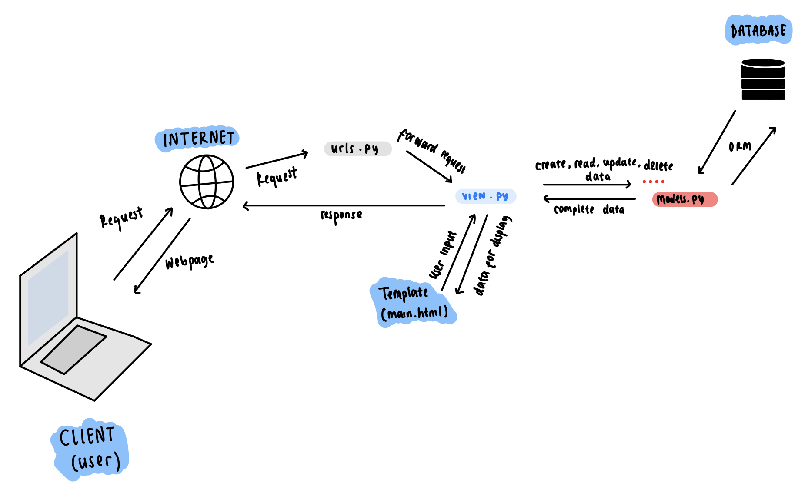

# Tugas 2: Implementasi Model-View-Template (MVT) pada Django
# PBP B

## SyreAttire
### Nama : Naila Syarifa Yosarvi
### NPM  : 2306245882
### Link : 

## 1. Jelaskan bagaimana cara kamu mengimplementasikan checklist di atas secara step-by-step (bukan hanya sekadar mengikuti tutorial).
- melakukan instalasi django dan setup github
- membuat virtual enviroment baru agar dependencies tidak akan bertabrakan dengan versi lain 
- menambahkan beberapa dependencis dan menginstallnya
- selanjutnya, membuat proyek django dengan nama SyreAttire
- selanjutkan melakukan perizinan terhadap akses semua host 
- menginisiasi direktori SyreAttire sebagai repo pada github
- kemudian menambahkan gitignore
- melakukan beberapa langkah membersihkan file sebelum di push ke github 
- membuat aplikasi bernama 'main' dan menambahkannya pada INSTALLED APPS
- membuat direktori baru bernama templates dan membuat file html
- melakukan routing agar dapat menjalankan aplikasi main tersebut 
- membuat model pada aplikasi dengan nama item serta atribute 
- kemudian membuat migrasi model dan menerapkan model tersebut ke basis data
- melakukan deployment ke Adaptable terhadap aplikasi yang sudah dibuat 

## 2. * Buatlah bagan yang berisi request client ke web aplikasi berbasis Django beserta responnya dan jelaskan pada bagan tersebut kaitan antara urls.py, views.py, models.py, dan berkas html.

- user akan menuliskan sesuatu di browser.
- klien(browser) mengirim permintaan HTTP ke Django.
- Django menerima permintaan dan menyampaikannya ke `urls.py`.
- `urls.py` akan mengarahkan request ke View sesuai url yang diterima.
- view dapat berinteraksi dengan model yang merupakan komponen yang bertanggung jawab terhadap database.
- setelah mendapatkan data dari model, maka View akan merender Template HTML dan diisi dengan data yang sesuai.
- view akan menghasilkan respons HTTP dan dikirimkan kembali ke klien.
- klien menerima respon dan menampilkan halaman web atau data yang diberikan.
- klien (browser) menampilkan halaman atau data kepada pengguna.

## 3. Jelaskan fungsi git dalam pengembangan perangkat lunak!
Dengan git user dapat mengetahui riwayat perubahan kode yang telah dilakukan, git juga bisa dilakukan kolaborator bagi para programmer dalam hal lain ini memudahkan para programmer dalam pengembangan perangkat lunak yang sedang dilakukan.

## 4. Menurut Anda, dari semua framework yang ada, mengapa framework Django dijadikan permulaan pembelajaran pengembangan perangkat lunak?
Django menyediakan fitur yang cukup cocok untuk pemula, dengan fitur dokumentasi yang lengkap, membantu user dalam mengatasi permasalahan dengan mudah. 

## 5. Mengapa model pada Django disebut sebagai ORM?
ORM merupakan teknik pemrograman yang memungkinkan user untuk berinteraksi dengan basis data relasional dalam bahasa pemrograman berorientasi objek,python. ORM sebagai perantara antara model objek dan tabel basis data, sehingga tidak perlu menuris query SQL untuk operasi basis data. 

